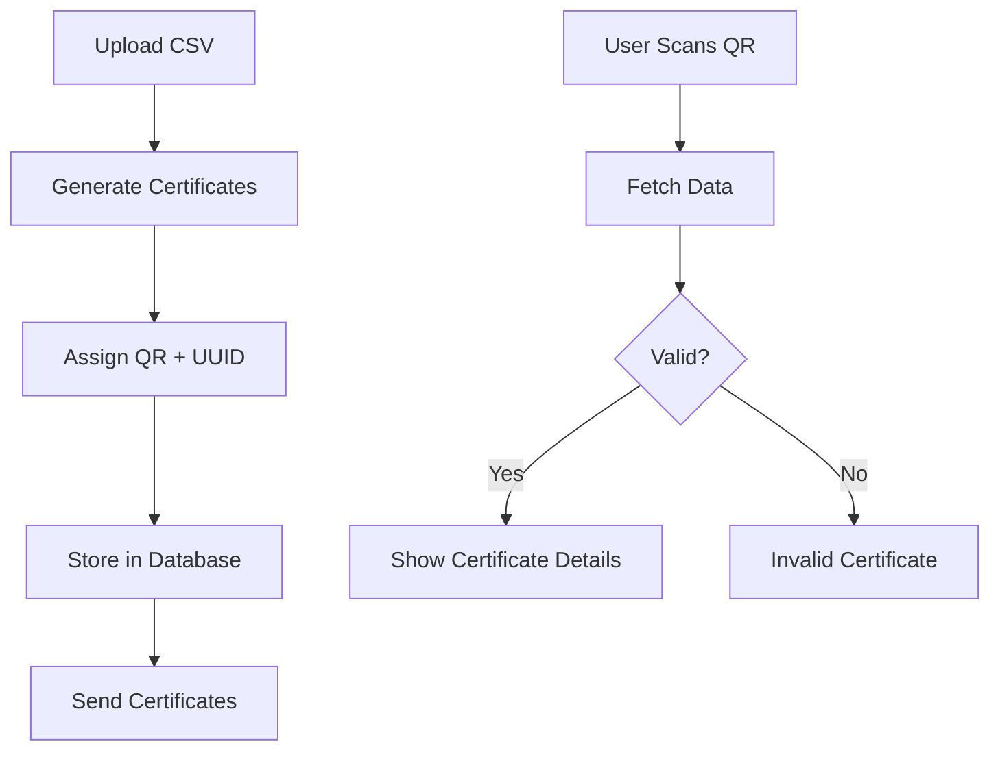

# 🎓 CertVerify

<div align="center">

🚀 **Generate • Distribute • Verify Certificates Securely**


</div>

---

## 🌟 Overview

CertVerify is a powerful platform designed for institutions to **generate and verify professional certificates** with complete security.

It prevents fake certificates using **QR codes and unique UUID-based validation**.

---

## 🎯 Problem

* Fake certificates are easy to create
* No centralized verification system
* Manual verification is slow and unreliable

---

## 💡 Solution

CertVerify introduces a **secure digital certificate system** where:

* Each certificate has a **unique QR code**
* Data is stored securely in a database
* Verification happens instantly in real-time

---

## ⚡ Key Features

* 🧾 Bulk certificate generation via CSV
* 📄 Automatic PDF certificate creation
* 🔗 Unique QR code per certificate
* 🔐 UUID-based authentication
* ⚡ Instant verification system
* 📊 Metadata display (course, date, issuer)
* 📧 Automated email distribution
* 🛡️ Fraud protection

---

## ⚙️ How It Works

### 1️⃣ Design & Upload

* Choose certificate template
* Upload recipient list via CSV

### 2️⃣ Generate

* Certificates generated automatically
* QR code + UUID assigned

### 3️⃣ Dispatch

* Certificates sent via email

---

## 🔍 Verification Flow



---

## 🛠️ Tech Stack

| Technology         | Usage                |
| ------------------ | -------------------- |
| HTML               | UI Structure         |
| CSS                | Styling              |
| JavaScript         | Frontend Logic       |
| Node.js / Firebase | Backend              |
| NoSQL DB           | Data Storage         |
| QR Code API        | Verification         |
| PDF Generator      | Certificate Creation |

---

## 📂 Project Structure

```bash
.
├── auth/
│   ├── login.html
│   └── register.html
│
├── dashboard/
│
├── verify/
│
├── js/
│
├── server.js
├── package.json
├── public-verification.html
└── README.md
```

---

## 📸 Screenshots

*(Add UI screenshots here for better presentation)*

---

## 🚀 Future Enhancements

* 🔗 Blockchain-based verification
* 📱 Mobile application
* 📊 Admin analytics dashboard
* 🏫 Multi-organization support

---

## 👨‍💻 Author

**Praveen Singh**
🎓 B.Tech CSE
💻 Full Stack Developer

---

## ⭐ Support

If you like this project, give it a ⭐ on GitHub!
